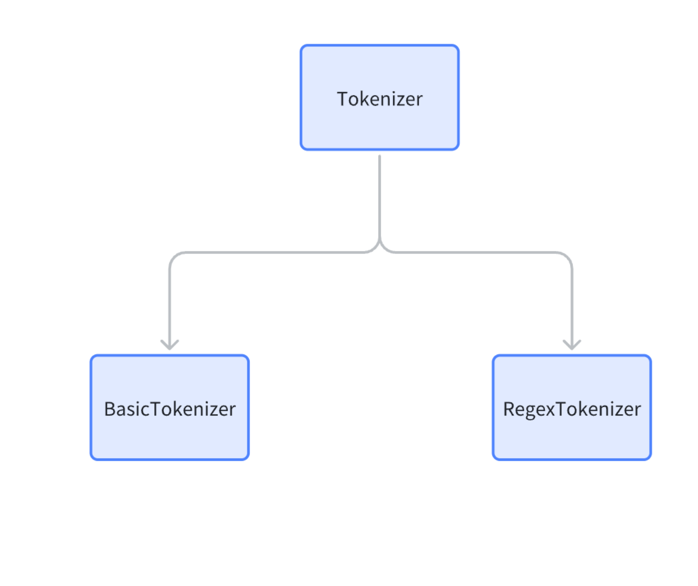

# 1 继承关系
## 1.1  Functions 
实现了基础的功能：
- get_stats --> 以2为窗口，对ids进行拆分，分成两两一对的pair，并对pair的出现次数进行计数
- Merge -->   用idx 替代ids中出现的所有的pair
- Render --> 把ids 转换为字符
## 1.2 Tokenizer
- .model 和 .vocab 文件的保存和加载功能
- 编码和解码方法（未实现）
## 1.3 BasicTokenizer
- 实现了基础的编码和解码方法，但是对于类似于这样的单词 "he's" 却没有定义如何拆分。
- 不能处理特殊符号
## 1.4 RegexTokenizer
- 定义了如何拆分复杂单词。
- 可以处理特殊符号。


# 2 重点代码
## 2.1 get_stats
- ids 是文本经过unicode转换后的生成的一个个的数字序列。
- 这个方法将以2为窗口大小对整个序列进行截取，生成新的pairs对。然后统计pairs的中每一对出现的次数，然后返回。

```python

def get_stats(ids, counts=None):
    """
    Given a list of integers, return a dictionary of counts of consecutive pairs
    Example: [1, 2, 3, 1, 2] -> {(1, 2): 2, (2, 3): 1, (3, 1): 1}
    Optionally allows to update an existing dictionary of counts
    """
    counts = {} if counts is None else counts
    for pair in zip(ids, ids[1:]): # iterate consecutive elements
        counts[pair] = counts.get(pair, 0) + 1
    return counts
```


## 2.2 merge
这段代码是把序列中的某一个pair，用一个新的idx替代

```python
def merge(ids, pair, idx):
    """
    In the list of integers (ids), replace all consecutive occurrences
    of pair with the new integer token idx
    Example: ids=[1, 2, 3, 1, 2], pair=(1, 2), idx=4 -> [4, 3, 4]
    """
    newids = []
    i = 0
    while i < len(ids):
        # if not at the very last position AND the pair matches, replace it
        if ids[i] == pair[0] and i < len(ids) - 1 and ids[i+1] == pair[1]:
            newids.append(idx)
            i += 2
        else:
            newids.append(ids[i])
            i += 1
    return newids
```
